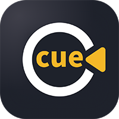

  </img>

<h3 align="center"><b>CueCut: Free & Open Video Editing for Web, Desktop — No VIP</b></a>
</h3>

<h3 align="center">
<a href="README.md"><b>English</b></a> | <a href="README_ZH.md"><b>中文</b></a>
</h3>

**Why? ：**  It’s well known that CapCut is an impressive tool that has led the industry trend in video editing. However, nearly all of its features are locked behind a paywall. Our vision is to fully leverage the power of the open-source community to build a truly open, genuinely free, and universally accessible AI-powered video editing ecosystem.   

It’s still young! We have lots of great, new and fun creative ideas and are working hard to build it out!      
If you have any questions about this project, or would like to contribute, please feel free to contact us in Issues!    

**License：** AGPL-3.0 is a permissive license that allows commercial use and is open source.   
 

## News

- **[2025-07-16]** 🚀 **CueCut Project library created!** 

show more

